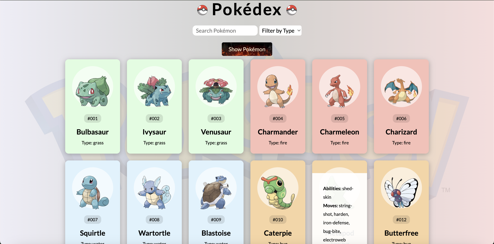

# Pokédex



A dynamic and interactive Pokédex application built with vanilla JavaScript, HTML, and CSS, using the PokéAPI to fetch data on all 1302 Pokémon. This project features a clean and responsive UI, allowing users to explore Pokémon by name, type, and through paginated navigation. It's a fun and educational way to dive into web development and APIs while catching 'em all!

## Key Features

- **Full Pokémon Dataset**: Displays detailed information for all Pokémon, including their type, abilities, and moves.
- **Search Functionality**: Instantly search for Pokémon by name, filtering results across the entire dataset.
- **Type Filtering**: Easily filter Pokémon by their primary type (e.g., Fire, Water, Grass).
- **Paginated Navigation**: Browse through Pokémon with seamless pagination, 200 Pokémon per page.
- **Dynamic UI**: Automatically fetches data from the PokéAPI and dynamically updates the UI with color-coded Pokémon cards based on their type.
- **Error Handling**: Handles API fetch errors gracefully to ensure a smooth user experience.

## Technologies Used
- **Frontend**: HTML, CSS, and JavaScript
- **API**: [PokéAPI](https://pokeapi.co/)

## How to Run
- Clone the repository:

```
git clone https://github.com/yourusername/pokedex.git
cd pokedex
```

Open `index.html` in your browser to start the application.

- Or check out the live [demo](https://chrisroland.github.io/Pokedex/)

Feel free to open any issues your encounter, or create pull requests for any features you think you can add.

This is open-sourced and I am open to constructive feedback and contributions!

Thanks! ❤️